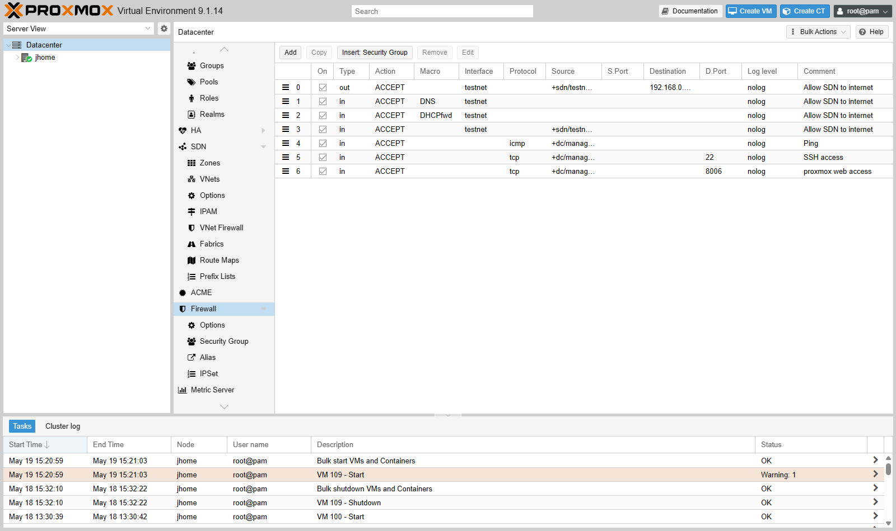

# JHomelab

My personal homelab, running Proxmox VE on an old Alienware 15 R3. I use it to practice the stuff I don't get to touch at work or in class — running a real hypervisor, carving up an SDN with separate subnets, writing firewall rules, and standing up Linux services in Docker. This repo is the running journal: hardware specs, network layout, VM inventory, what's deployed, what's planned next, and a changelog of what I actually did and when.

## What's in this repo

Right now this is a documentation-only repo. I'll add sanitized configs (SDN exports, firewall rules, Docker compose files, Bash scripts) as separate sub-directories once they settle. The course repos that fed into this build are:

- [SVAD-111-Linux-Virtualization](https://github.com/jkosber/SVAD-111-Linux-Virtualization) — Linux admin and virtualization coursework
- [Networking-109](https://github.com/jkosber/Networking-109) — CCNA Networking I (Cisco IOS, addressing, routing)
- [CyberOps-115](https://github.com/jkosber/CyberOps-115) — Cisco CyberOps Associate (Security Onion, Snort, packet analysis)

## What I get out of running it

- Hypervisor admin on a real Proxmox install (currently PVE 9.1.0, kernel 6.17).
- Software-defined networking — VNets, managed IPAM/DHCP, predictable per-VM addressing.
- Per-distribution Linux practice (Debian/Ubuntu, RHEL/Fedora, Arch, SUSE, Pop!, Mint, Zorin) without polluting my daily-driver.
- PCI passthrough — the GTX 1070 Mobile is bound to `vfio-pci` for VM use.
- Docker via Portainer for the always-on services on VM 109.
- A documented, reproducible lab I can rebuild from notes if the host gets wiped.

## Network layout

- **Core router** — TP-Link AX6600 Tri-Band Wi-Fi 6. Routing, DHCP, edge firewall.
- **Distribution** — Netgear WN2000RPTv2 range extender, SSID broadcast off, used as a wireless bridge into the lab segment. Planned upgrade: replace with a Cat6 backhaul for gigabit stability.
- **Access** — still flat. Plan is to drop in a managed switch so I can do 802.1Q VLAN tagging between home, lab, and management.

## Physical host — `jhome`

| Component         | Specification                  | Role / Pool                                                  |
| :---------------- | :----------------------------- | :----------------------------------------------------------- |
| Platform          | Alienware 15 R3                | Hypervisor host                                              |
| Hypervisor        | Proxmox VE 9.1.0 / kernel 6.17 | Bare metal                                                   |
| Management IP     | `192.168.0.2`                  | Web UI at `https://192.168.0.2:8006`                         |
| CPU               | Intel i7-7700HQ (4C / 8T)      | Core compute                                                 |
| RAM               | 16 GB DDR4                     | Over-provisioned across VMs (~48 GB assigned)                |
| GPU (host)        | Intel HD Graphics 630          | Console / host display                                       |
| GPU (passthrough) | NVIDIA GTX 1070 Mobile         | Bound to `vfio-pci`, target VM 100 / 109                     |
| SSD               | SK Hynix 120 GB                | `local`, `local-lvm` (OS, ISOs)                              |
| HDD               | HGST 1 TB                      | `vmdata` (VM store, future NAS target)                       |

## SDN and IPAM

I'm using Proxmox's built-in SDN to keep the home LAN separate from the experimental lab subnet. Anything I'm poking at — broken Linux installs, Kali scans, opnsense builds — lives on `testnet` so it can't accidentally talk to the production stuff.

| Zone     | Bridge / VNet | Subnet            | IPAM                      | Gateway        |
| :------- | :------------ | :---------------- | :------------------------ | :------------- |
| Home LAN | `vmbr0`       | `192.168.0.0/24`  | Static / external DHCP    | `192.168.0.1`  |
| Lab SDN  | `testnet`     | `10.10.100.0/24`  | PVE IPAM (dynamic DHCP)   | `10.10.100.1`  |

**Addressing rule.** Lab VMs use a one-to-one mapping where the last octet matches the VMID. VM 105 → 10.10.100.105. Makes it easy to correlate the Proxmox inventory with packet captures and firewall logs.

### Firewall (Datacenter level)

The current allowlist: SDN egress to the internet, in-zone DNS and DHCP for the lab subnet, plus a tight management ACL (Ping, SSH on 22, web UI on 8006) restricted to the management interface group.

*Datacenter > Firewall — seven active allow rules. Per-VNet and per-VM firewalls are the next layer to fill in.*

## Virtual machines

RAM commitment (~48 GB) is intentionally over the 16 GB physical. Only VM 109 is set to auto-boot, so the over-commit only matters when I'm actively running a specific lab scenario.

*Datacenter view — every VM (100–109), the two zones, the `jhome` node, and the three storage pools in one place.*

### Always-on / infrastructure

| VMID | Name             | IP                  | OS               | RAM  | State    | Role                                       |
| :--- | :--------------- | :------------------ | :--------------- | :--- | :------- | :----------------------------------------- |
| 109  | `Ubuntu-Server`  | `192.168.0.159`     | Ubuntu 24.04     | 2 GB | Running  | Core infra / Docker host                   |
| 100  | `Ubuntu-Desktop` | `10.10.100.100`     | Ubuntu Desktop   | 8 GB | Stopped  | Workstation / current Tailscale node       |
| 102  | `opnsense`       | `10.10.100.102`     | FreeBSD          | 3 GB | WIP      | Lab gateway (single-NIC, in progress)      |

### Cyber range / distro lab (`testnet`)

| VMID | Name               | IP               | OS                  | RAM  | Disk  |
| :--- | :----------------- | :--------------- | :------------------ | :--- | :---- |
| 101  | `Kali`             | `10.10.100.101`  | Kali Linux          | 2 GB | 30 GB |
| 103  | `OpenSUSE-Desktop` | `10.10.100.103`  | OpenSUSE Tumbleweed | 4 GB | 30 GB |
| 104  | `Fedora-Desktop`   | `10.10.100.104`  | Fedora 40           | 4 GB | 30 GB |
| 105  | `ZorinOS`          | `10.10.100.105`  | Zorin OS 17         | 8 GB | 40 GB |
| 106  | `Manjaro-Desktop`  | `10.10.100.106`  | Manjaro (Arch)      | 4 GB | 30 GB |
| 107  | `Linux-Mint`       | `10.10.100.107`  | Linux Mint 21       | 4 GB | 30 GB |
| 108  | `PopOS`            | `10.10.100.108`  | Pop!_OS             | 8 GB | 30 GB |

## Services on VM 109

Docker stack, managed through Portainer.

| Service             | Port    | State   | What it does                       |
| :------------------ | :------ | :------ | :--------------------------------- |
| Homepage            | 3000    | Running | Central dashboard                  |
| Uptime Kuma         | 3001    | Running | Service health monitoring          |
| Portainer           | 9443    | Running | Container management UI            |
| Nginx Proxy Manager | 81      | Planned | Reverse proxy + Let's Encrypt      |
| RustDesk Server     | 21115+  | Planned | Self-hosted remote support         |

## Roadmap

**Infrastructure**

- Cat6 backhaul to replace the wireless bridge.
- Managed switch + 802.1Q VLAN tagging.
- Nginx Proxy Manager so I can use clean internal hostnames (`proxmox.home`, `dash.home`, etc.).
- Internal DNS — leaning AdGuard Home over Pi-hole.
- A dedicated NAS VM on the 1 TB HDD for SMB / NFS.

**Security / cyber lab**

- Move the Tailscale subnet router off VM 100 onto VM 109 so it's always reachable.
- Per-zone firewall rules in PVE for strict segmentation between home, lab, and management.
- Wazuh or Security Onion for SIEM / IDS on inter-zone traffic.
- Jellyfin with the GTX 1070 doing hardware-accelerated transcoding.

## Maintenance notes

*Node `jhome` — Network, Certificates, DNS, Firewall, Disks (LVM/LVM-Thin/ZFS/Directory), Repositories. Most host-level work happens here.*

- GRUB has `pcie_acs_override=downstream,multifunction` for PCI passthrough.
- IOMMU verified — NVIDIA GP104BM (GTX 1070 Mobile) is bound to `vfio-pci`.
- SDN config lives in `/etc/pve/sdn/` on the host.

## Changelog

### April 2026 — service tier
- Confirmed VM 109 as the only auto-boot VM. The over-committed RAM pool only matters when I'm running a scenario.
- Lined up Nginx Proxy Manager + RustDesk Server as the next services to deploy.

### February 2026 — infrastructure pass
- Audited the host. Kernel 6.17 + PVE 9.1 stable.
- Documented the GTX 1070 passthrough state and the full distro-lab inventory (100–109).
- Locked in the SDN `testnet` config and the VMID-to-IP rule.
- Expanded the roadmap with SIEM (Wazuh), NPM, managed switching, and internal DNS.

### January 2026 — foundation
- Set up the TP-Link AX6600 as the core router.
- Split the wireless into two SSIDs (`SSID_ExistingNetwork` and `SSID_HomelabNetwork`).
- Installed Proxmox VE on the Alienware host.
- Brought up the first VMs — Ubuntu Server, Ubuntu Desktop, Kali.
- Verified static and dynamic addressing, gateway routing, and CLI connectivity.
