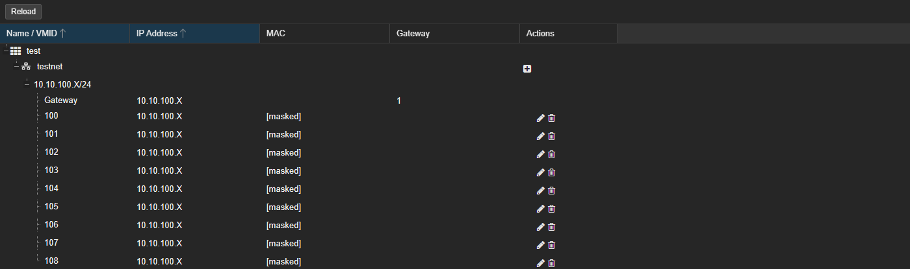
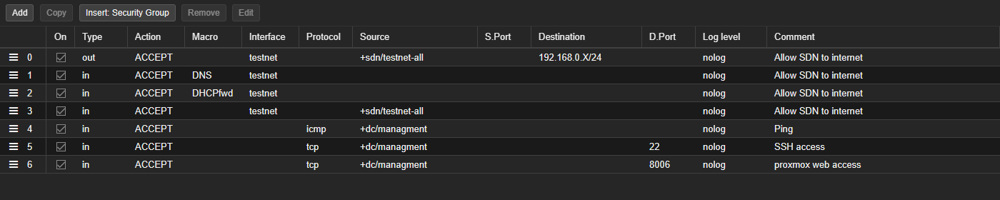
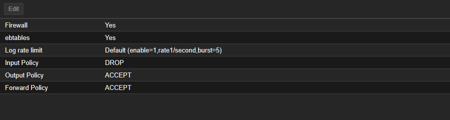
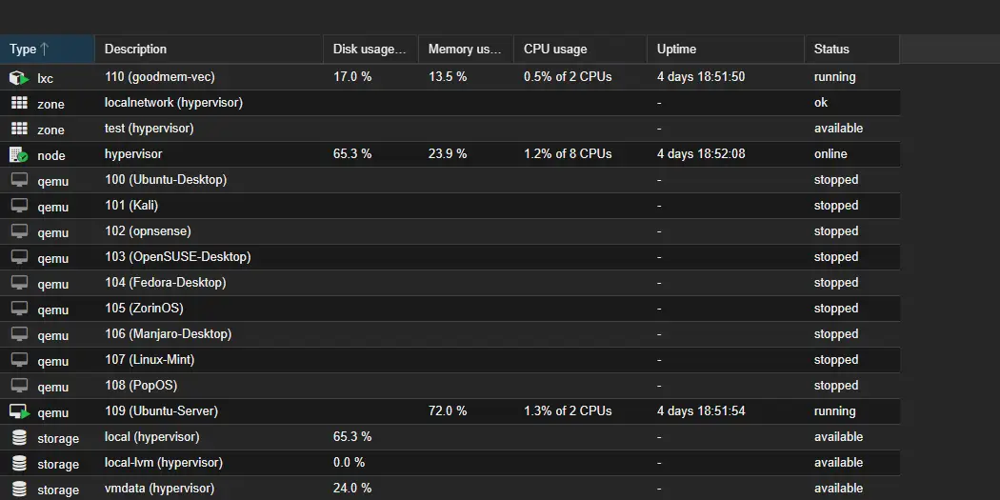

# JHomelab

My personal homelab, running Proxmox VE on an old Alienware 15 R3. I use it to practice the stuff I don't get to touch at work or in class — running a real hypervisor, carving up an SDN with separate subnets, writing firewall rules, and standing up Linux services in Docker. This repo is the running journal: hardware specs, network layout, VM inventory, what's deployed, what's planned next, and a changelog of what I actually did and when.

## What's in this repo

Right now this is a documentation-only repo. I'll add sanitized configs (SDN exports, firewall rules, Docker compose files, Bash scripts) as separate sub-directories once they settle. The course repos that fed into this build are:

- [SVAD-111-Linux-Virtualization](https://github.com/jkosber/SVAD-111-Linux-Virtualization) — Linux admin and virtualization coursework
- [Networking-109](https://github.com/jkosber/Networking-109) — CCNA Networking I (Cisco IOS, addressing, routing)
- [CyberOps-115](https://github.com/jkosber/CyberOps-115) — Cisco CyberOps Associate (Security Onion, Snort, packet analysis)

Last Proxmox update: **September 22, 2026**. The [health-check notes](docs/health-check-2026-09-22.md) have the scan details. Local IPs have the last number replaced with `X`.

## What I get out of running it

- Hypervisor admin on a real Proxmox install (currently PVE 9.2.20, kernel 7.0.14-17-pve).
- Software-defined networking — VNets, managed IPAM/DHCP, predictable per-VM addressing.
- Per-distribution Linux practice (Debian/Ubuntu, RHEL/Fedora, Arch, SUSE, Pop!, Mint, Zorin) without polluting my daily-driver.
- PCI passthrough — the GTX 1070 Mobile is bound to `vfio-pci` for VM use.
- Docker via Portainer for the always-on services on VM 109.
- A documented, reproducible lab I can rebuild from notes if the host gets wiped.

## Network layout

- **Core router** — TP-Link AX6600 Tri-Band Wi-Fi 6. Routing, DHCP, edge firewall.
- **Distribution** — Netgear WN2000RPTv2 range extender, SSID broadcast off, used as a wireless bridge into the lab segment. Planned upgrade: replace with a Cat6 backhaul for gigabit stability.
- **Access** — still flat. Plan is to drop in a managed switch so I can do 802.1Q VLAN tagging between home, lab, and management.

## Physical host — `jhome`

| Component | Specification | Role / Pool |
| :--- | :--- | :--- |
| Platform | Alienware 15 R3 | Hypervisor host |
| Hypervisor | Proxmox VE 9.2.20 / kernel 7.0.14-17-pve | Bare metal |
| Management IP | `192.168.0.X` | Web UI at `https://192.168.0.X:8006` |
| CPU | Intel i7-7700HQ (4C / 8T) | Core compute |
| RAM | 16 GB DDR4 | Over-provisioned across the lab guests |
| GPU (host) | Intel HD Graphics 630 | Console / host display |
| GPU (passthrough) | NVIDIA GTX 1070 Mobile | Bound to `vfio-pci`, configured for VMs 100, 105, 107 and 108 |
| SSD | SK Hynix 128 GB | `local`, `local-lvm` (OS, ISOs) |
| HDD | HGST 1 TB | `vmdata` (VM store, future NAS target) |

## SDN and IPAM

I'm using Proxmox's built-in SDN for the experimental lab subnet. Anything I'm poking at — broken Linux installs, Kali scans, opnsense builds — lives on `testnet`. It's already configured for VMs 100–108. The service guests, VM 109 and CT 110, are still on `vmbr0`; moving them onto the SDN is planned.

| Network | Zone | Bridge / VNet | Subnet | IPAM | Gateway |
| :--- | :--- | :--- | :--- | :--- | :--- |
| Home LAN | — | `vmbr0` | `192.168.0.X/24` | Static / external DHCP | `192.168.0.X` |
| Lab SDN | `test` | `testnet` | `10.10.100.X/24` | PVE IPAM (DHCP) | `10.10.100.X` |

Lab VMs have address mappings in IPAM so they're easy to track.

*IPAM mappings for the lab gateway and VMs 100–108. IPs and MAC addresses are masked.*

### Firewall (Datacenter level)

The base input policy is **DROP**: incoming traffic needs an accept rule. Output and forwarding are set to **ACCEPT**.

The seven allow rules cover lab network access, DNS and DHCP, plus management access for Ping, SSH on 22 and the web UI on 8006.

*Datacenter > Firewall — seven enabled allow rules. Per-VNet and per-VM firewalls are the next layer to fill in.*

*Firewall enabled, with default-drop input.*

## Virtual machines

The VMs have about 47 GB of RAM assigned, plus 4 GB for the GoodMem container, against 16 GB in the host. VM 109 and CT 110 are set to auto-boot. The other guests stay stopped until I'm working on a lab.

*September 22 — VM 109 and CT 110 running, with VMs 100–108 stopped.*

### Always-on / infrastructure

| ID | Name | IP | OS | RAM | Disk | State | Role |
| :--- | :--- | :--- | :--- | :--- | :--- | :--- | :--- |
| VM 109 | `Ubuntu-Server` | `192.168.0.X` | Ubuntu Server | 2 GB | 32 GB | Running | Core infra / Docker host |
| CT 110 | `goodmem-vec` | `192.168.0.X` | Debian 13.1 | 4 GB | 24 GB | Running | GoodMem / PostgreSQL |

### Cyber range / distro lab (`testnet`)

All nine lab VMs were stopped at the time of the update.

| VMID | Name | IP | OS | RAM | Disk |
| :--- | :--- | :--- | :--- | :--- | :--- |
| 100 | `Ubuntu-Desktop` | `10.10.100.X` | Ubuntu Desktop | 8 GB | 200 GB |
| 101 | `Kali` | `10.10.100.X` | Kali Linux | 2 GB | 30 GB |
| 102 | `opnsense` | `10.10.100.X` | FreeBSD / OPNsense | 3 GB | 16 GB |
| 103 | `OpenSUSE-Desktop` | `10.10.100.X` | openSUSE | 4 GB | 30 GB |
| 104 | `Fedora-Desktop` | `10.10.100.X` | Fedora | 4 GB | 30 GB |
| 105 | `ZorinOS` | `10.10.100.X` | Zorin OS | 8 GB | 40 GB |
| 106 | `Manjaro-Desktop` | `10.10.100.X` | Manjaro (Arch) | 4 GB | 30 GB |
| 107 | `Linux-Mint` | `10.10.100.X` | Linux Mint | 4 GB | 30 GB |
| 108 | `PopOS` | `10.10.100.X` | Pop!_OS | 8 GB | 30 GB |

VM 100 also serves as the Tailscale node. The single-NIC OPNsense gateway on VM 102 is still a work in progress.

## Services on VM 109

Docker stack, managed through Portainer.

| Service | Port | State | What it does |
| :--- | :--- | :--- | :--- |
| Homepage | 3000 | Running | Central dashboard |
| Uptime Kuma | 3001 | Running | Service health monitoring |
| Portainer | 9443 | Running | Container management UI |
| Nginx Proxy Manager | 81 | Planned | Reverse proxy + Let's Encrypt |
| RustDesk Server | 21115+ | Planned | Self-hosted remote support |

Homepage, Uptime Kuma and Portainer all responded during the check.

## Services on CT 110

GoodMem runs in a separate Debian LXC container.

| Service | Port | State | What it does |
| :--- | :--- | :--- | :--- |
| GoodMem | 8080 (REST), 9090 (gRPC) | Healthy | Memory service |
| PostgreSQL / pgvector | 5432 | Running | GoodMem database and vector storage |

## Roadmap

**Infrastructure**

- Cat6 backhaul to replace the wireless bridge.
- Managed switch + 802.1Q VLAN tagging.
- Extend the SDN to the service guests.
- Nginx Proxy Manager so I can use clean internal hostnames (`proxmox.home`, `dash.home`, etc.).
- Internal DNS — leaning AdGuard Home over Pi-hole.
- A dedicated NAS VM on the 1 TB HDD for SMB / NFS.

**Security / cyber lab**

- Move the Tailscale subnet router off VM 100 onto VM 109 so it's always reachable.
- Per-zone firewall rules in PVE for strict segmentation between home, lab, and management.
- Wazuh or Security Onion for SIEM / IDS on inter-zone traffic.
- Jellyfin with the GTX 1070 doing hardware-accelerated transcoding.

## Maintenance notes

- GRUB has `pcie_acs_override=downstream` for PCI passthrough.
- IOMMU verified — NVIDIA GP104BM (GTX 1070 Mobile) is bound to `vfio-pci`.
- SDN config lives in `/etc/pve/sdn/` on the host.
- The boot SSD still has SMART warnings. Backup coverage and a restore test need a follow-up; details are in the [health-check notes](docs/health-check-2026-09-22.md#storage-and-backups).

## Changelog

### September 2026 — Proxmox update

- Updated PVE and kernel versions, VM resources and GPU assignments.
- Added CT 110 and its running GoodMem / PostgreSQL services.
- Refreshed the inventory, firewall and IPAM screenshots.
- Documented the firewall defaults and planned SDN rollout to the service guests.
- Kept the IP schemes in the notes, with the last number masked.

### April 2026 — service tier

- Confirmed VM 109 as the only auto-boot VM. The over-committed RAM pool only matters when I'm running a scenario.
- Lined up Nginx Proxy Manager + RustDesk Server as the next services to deploy.

### February 2026 — infrastructure pass

- Audited the host. Kernel 6.17 + PVE 9.1 stable.
- Documented the GTX 1070 passthrough state and the full distro-lab inventory (100–109).
- Locked in the SDN `testnet` config and IPAM mappings.
- Expanded the roadmap with SIEM (Wazuh), NPM, managed switching, and internal DNS.

### January 2026 — foundation

- Set up the TP-Link AX6600 as the core router.
- Split the wireless into two SSIDs (`SSID_ExistingNetwork` and `SSID_HomelabNetwork`).
- Installed Proxmox VE on the Alienware host.
- Brought up the first VMs — Ubuntu Server, Ubuntu Desktop, Kali.
- Verified static and dynamic addressing, gateway routing, and CLI connectivity.
