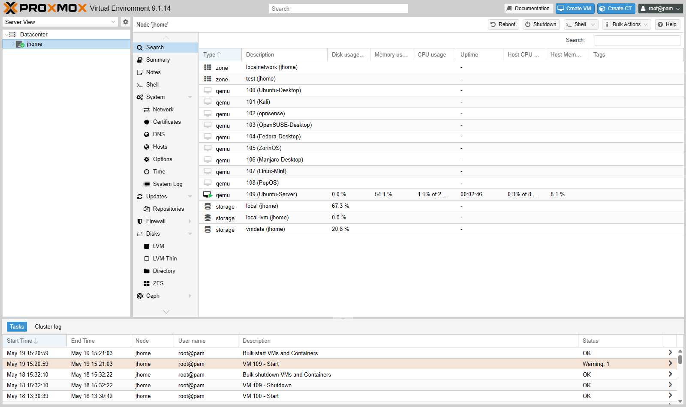

# JHomelab — Personal Proxmox Lab Documentation

This repository documents my personal home lab built on Proxmox VE. It is the running journal for the infrastructure, networking, and security work I do outside of class and the dental-IT internship — virtualization, SDN-based segmentation, Linux administration, Docker services, and an ongoing roadmap toward SIEM, managed switching, and reverse-proxy deployment.

The lab is intentionally designed to mirror small-enterprise patterns (segmented zones, IPAM, change logging, reproducible builds) inside a single home network, and it evolves as I work through new coursework and homelab projects.

## Repository contents

This repository is currently documentation-only — the source of truth for layout, addressing, and configuration decisions. Sanitized configs (SDN exports, firewall rule snapshots, container compose files, Bash provisioning scripts) will be committed as separate sub-directories once they reach a stable state. The accompanying course-dump repositories ([SVAD-111-Linux-Virtualization](https://github.com/jkosber/SVAD-111-Linux-Virtualization), [Networking-109](https://github.com/jkosber/Networking-109), [CyberOps-115](https://github.com/jkosber/CyberOps-115)) hold the formal lab artifacts that fed into the homelab build.

## Skills demonstrated

- Hypervisor administration (Proxmox VE 9.1, kernel 6.17)
- Software-defined networking (PVE SDN, VNets, managed IPAM/DHCP)
- Subnetting and per-zone addressing strategy (VMID → IP mapping)
- Linux administration across distribution families (Debian/Ubuntu, RHEL/Fedora, Arch, SUSE, etc.)
- PCI passthrough and VFIO isolation for a discrete GPU
- Docker via Portainer (Homepage, Uptime Kuma; reverse-proxy and remote-support work on the roadmap)
- Documentation discipline — architecture overview, inventory, change log, roadmap kept in source control

## System architecture

### Core network layer
- TP-Link AX6600 Tri-Band Wi-Fi 6 router — primary routing, DHCP, and edge firewall.

### Distribution / extension layer
- Netgear WN2000RPTv2 universal Wi-Fi range extender — SSID broadcast disabled, used as a wireless bridge into the lab segment.
- Planned upgrade: replace the wireless bridge with a physical Cat6 backhaul for gigabit stability.

### Access layer
- Currently flat at the access layer. Planned upgrade: introduce a managed switch to support hardware-level 802.1Q VLAN segmentation between home, lab, and management zones.

## Physical host — `jhome`

| Component       | Specification                | Role / Pool                                                  |
| :-------------- | :--------------------------- | :----------------------------------------------------------- |
| Platform        | Alienware 15 R3              | Hypervisor host                                              |
| Hypervisor      | Proxmox VE 9.1.0 / kernel 6.17 | Bare metal                                                   |
| Management IP   | `192.168.0.2`                | Reached over the home LAN at `https://192.168.0.2:8006`      |
| CPU             | Intel i7-7700HQ (4C / 8T)    | Core compute                                                 |
| RAM             | 16 GB DDR4                   | Over-provisioned lab pool (~48 GB assigned across VMs)       |
| GPU (host)      | Intel HD Graphics 630        | Console / host display                                       |
| GPU (passthrough) | NVIDIA GTX 1070 Mobile    | Bound to `vfio-pci`, target VM 100 / 109                     |
| SSD             | SK Hynix 120 GB              | `local`, `local-lvm` — OS, ISOs                              |
| HDD             | HGST 1 TB                    | `vmdata` — primary VM store / NAS target                     |

## Phase 2 — SDN and IPAM

The lab uses Proxmox's built-in SDN to keep production-style traffic on the home LAN isolated from experimental zones used for cyber range and distro testing.

### Network zones

| Zone     | Bridge / VNet | Subnet            | IPAM Strategy             | Gateway        |
| :------- | :------------ | :---------------- | :------------------------ | :------------- |
| Home LAN | `vmbr0`       | `192.168.0.0/24`  | Static / external DHCP    | `192.168.0.1`  |
| Lab SDN  | `testnet`     | `10.10.100.0/24`  | PVE IPAM (dynamic DHCP)   | `10.10.100.1`  |

### Addressing convention

Lab VMs use a one-to-one mapping where the last octet matches the VMID. Example: VM **105** → IP **10.10.100.105**. This trivially correlates the Proxmox inventory with packet captures and firewall logs.

## Phase 3 — Virtual machine inventory

Total RAM assigned (~48 GB) intentionally exceeds physical (16 GB); only VM 109 (core infra) is set to auto-boot, so memory is over-provisioned only when a specific lab scenario is running.

*Datacenter view in the Proxmox VE web UI — all VMs (100–109), SDN zones (`localnetwork`, `test`), the `jhome` node, and the three storage pools (`local`, `local-lvm`, `vmdata`) at a glance.*

### Infrastructure / high-performance

| VMID | Name             | IP Address          | OS               | RAM  | Status   | Role                                       |
| :--- | :--------------- | :------------------ | :--------------- | :--- | :------- | :----------------------------------------- |
| 109  | `Ubuntu-Server`  | `192.168.0.159`     | Ubuntu 24.04     | 2 GB | Running  | Core infra / Docker host                   |
| 100  | `Ubuntu-Desktop` | `10.10.100.100`     | Ubuntu Desktop   | 8 GB | Stopped  | Workstation / current Tailscale node       |
| 102  | `opnsense`       | `10.10.100.102`     | FreeBSD          | 3 GB | WIP      | Lab gateway (single-NIC build in progress) |

### Cyber range / distro lab on `testnet`

| VMID | Name               | IP Address       | OS Distribution        | RAM  | Disk  |
| :--- | :----------------- | :--------------- | :--------------------- | :--- | :---- |
| 101  | `Kali`             | `10.10.100.101`  | Kali Linux             | 2 GB | 30 GB |
| 103  | `OpenSUSE-Desktop` | `10.10.100.103`  | OpenSUSE Tumbleweed    | 4 GB | 30 GB |
| 104  | `Fedora-Desktop`   | `10.10.100.104`  | Fedora 40              | 4 GB | 30 GB |
| 105  | `ZorinOS`          | `10.10.100.105`  | Zorin OS 17            | 8 GB | 40 GB |
| 106  | `Manjaro-Desktop`  | `10.10.100.106`  | Manjaro (Arch)         | 4 GB | 30 GB |
| 107  | `Linux-Mint`       | `10.10.100.107`  | Linux Mint 21          | 4 GB | 30 GB |
| 108  | `PopOS`            | `10.10.100.108`  | Pop!_OS                | 8 GB | 30 GB |

## Phase 4 — Primary services on VM 109

Docker stack managed via Portainer.

| Service              | Port    | Status   | Description                                |
| :------------------- | :------ | :------- | :----------------------------------------- |
| Homepage             | 3000    | Running  | Central dashboard                          |
| Uptime Kuma          | 3001    | Running  | Service health monitoring                  |
| Portainer            | 9443    | Running  | Container orchestration                    |
| Nginx Proxy Manager  | 81      | Planned  | Reverse proxy + SSL management             |
| RustDesk Server      | 21115+  | Planned  | Self-hosted remote support                 |

## Phase 5 — Roadmap

### Core infrastructure and services
- Replace the wireless bridge with physical Cat6 backhaul.
- Procure and configure a managed switch for 802.1Q VLAN tagging.
- Stand up Nginx Proxy Manager and assign internal hostnames (e.g., `proxmox.home`).
- Deploy internal DNS — AdGuard Home or Pi-hole.
- Carve out a dedicated NAS VM on the 1 TB HDD for SMB / NFS shares.

### Cybersecurity lab expansion
- Move the Tailscale subnet router onto VM 109 to replace the VM-100 instance.
- Author per-zone firewall rules in PVE for strict hardware/software segmentation.
- Deploy Wazuh or Security Onion for SIEM and IDS coverage of inter-zone traffic.
- Stand up Jellyfin with hardware acceleration against the GTX 1070.

## Maintenance and configuration notes

*Node-level configuration tree for the `jhome` host — Network, Certificates, DNS, Firewall, Disks (LVM, LVM-Thin, ZFS, Directory) and Repositories are where most of the host-level maintenance work happens.*

- PCI ACS override active in GRUB: `pcie_acs_override=downstream,multifunction`.
- IOMMU verified for NVIDIA GP104BM (GTX 1070 Mobile) — bound to `vfio-pci`.
- SDN configuration lives under `/etc/pve/sdn/` on the host.

## Operational journal

### April 2026 — Service-tier refinement
- Reaffirmed VM 109 as the only auto-boot host so the over-provisioned RAM pool only loads on demand.
- Catalogued the existing Docker stack and identified Nginx Proxy Manager + RustDesk Server as the next priorities.

### February 2026 — Infrastructure deep-dive
- Audited Proxmox host: confirmed kernel 6.17 and PVE 9.1 stable.
- Hardware inventory: documented GTX 1070 passthrough state and finalized distro-lab inventory (VMIDs 100–109).
- Network mapping: locked in SDN `testnet` logic and the VMID-to-IP convention.
- Roadmap expanded to include SIEM (Wazuh), reverse proxy (NPM), managed switching, and internal DNS.

### January 2026 — Foundational phase
- Repurposed the TP-Link AX6600 as the core router.
- Split wireless into two SSIDs: `SSID_ExistingNetwork` and `SSID_HomelabNetwork`.
- Installed Proxmox VE on the Alienware host.
- Brought up the initial VM stack — Ubuntu Server, Ubuntu Desktop, Kali Linux.
- Verified static and dynamic addressing, gateway routing, and connectivity from the Linux CLI.

## Goals

- Practice enterprise-style network segmentation, IPAM, and change logging at home-lab scale.
- Maintain hands-on familiarity with virtualization, Linux administration, and Docker services.
- Build a documented, reproducible lab that I can rebuild from notes if the host is wiped.
- Use the lab as the substrate for security tooling (SIEM, IDS, packet capture) as coursework expands into them.
